# Admin guide — where staff edit each part of the site

Log in at `/wp-admin/`. Everything specific to Heartland lives under the **Heartland** menu (paw icon); pages under **Pages**; blog posts under **Posts**. Field names below are quoted exactly as they appear on screen.

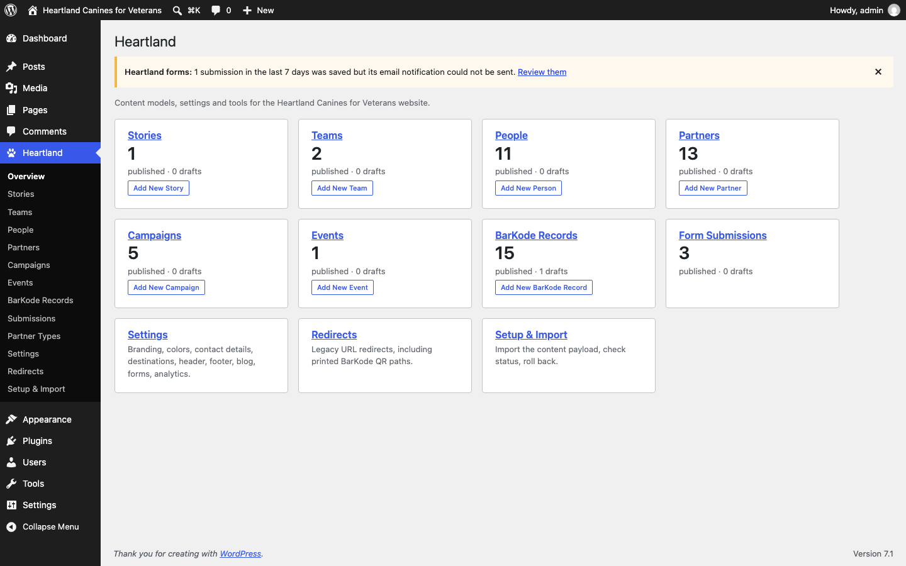

## How page editing works

Every page has two layers: the **block editor canvas** at the top (used on migrated pages, News and Privacy Policy) and a box titled **Sections — <template name>** below it (open the **Meta Boxes** bar if collapsed). Each section is a collapsible panel of fields; which sections exist depends on the page's **Template** (sidebar → **Page** tab → **Template**).

The sidebar panel **Page sections** controls order and visibility: *"Drag, or use the arrow buttons, to reorder. Untick a section to hide it without losing its content."* The hero is always shown on the section templates (on the default template it can be unticked — see [New pages](#new-pages-the-default-template-and-the-heartland-patterns)). The same panel has **Editor content**, which places anything written in the block canvas before or after the sections (or hides it) — see [Adding extra content to section pages](#adding-extra-content-to-section-pages). Save with the blue **Save** button. Section content, the section order and the Editor content setting are all part of the page's revisions: the **Revisions** screen (linked from the sidebar) shows them line by line — "Section layout" lists *Order*, *Hidden* and *Editor content* — and restoring a revision brings them back with it.

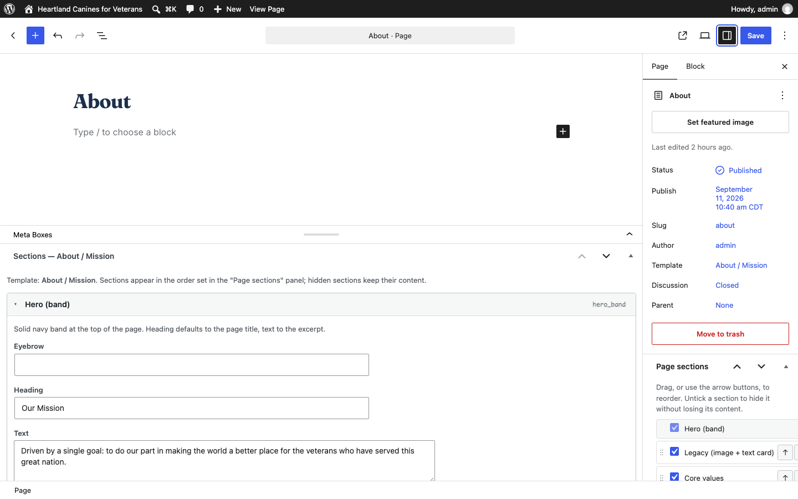
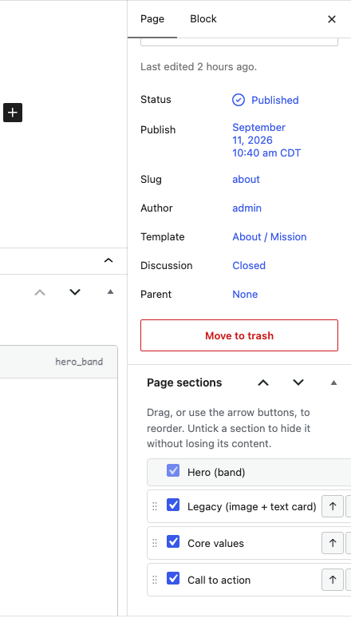

Field types you will meet everywhere:

- **Image** — **Select image** / **Replace** / **Remove**; the picker has **Upload files** and **Media Library** tabs, then **Use this**.
- **Link** — **Label**, then **Page / record** (type in "Search pages and records…") or **External URL**; optional **Open in a new tab**. Prefer Page / record: it follows the page if its slug changes.
- **Repeaters** (cards, buttons, tiers, rows) — **Add …** button, ↑ ↓ to reorder, × to remove.
- **Story / Team / Partner pickers** — "Type to search…" and pick a chip.

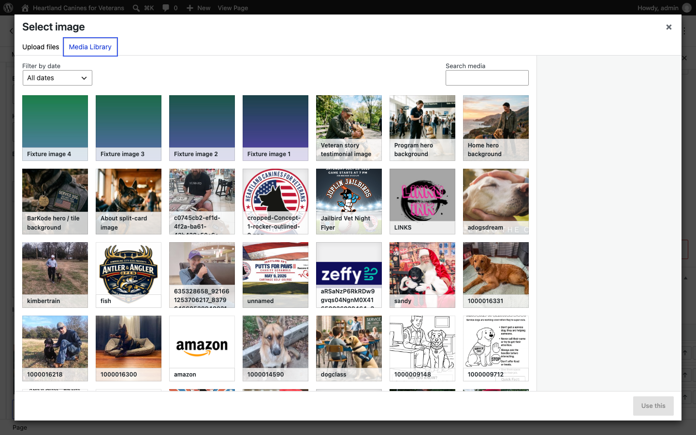

## Edit the Home page hero

**Pages → Home** (template *Home (sections)*) → section **Hero (image)**: **Eyebrow badge**, **Eyebrow icon**, **Heading** (required), **Line break after word**, **Text**, **Background image**, **Background image (mobile)**, **Focal point**, **Height**, **Navy overlay opacity**, **Add dark gradient**, **Buttons** (max 2: **Link** + **Style** = Primary (crimson) / Outline (light)), **Entrance animation**.

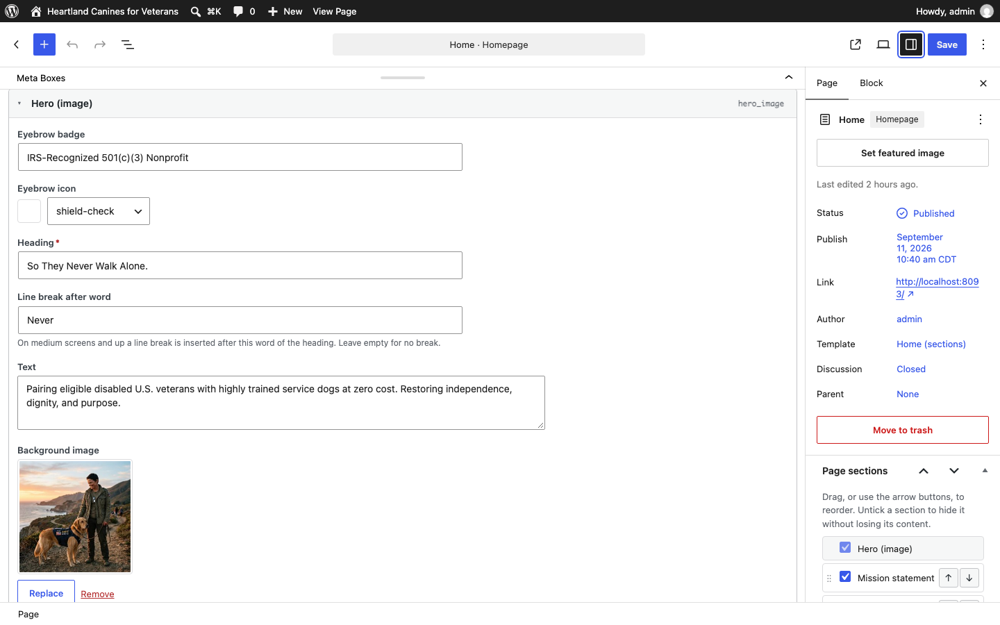
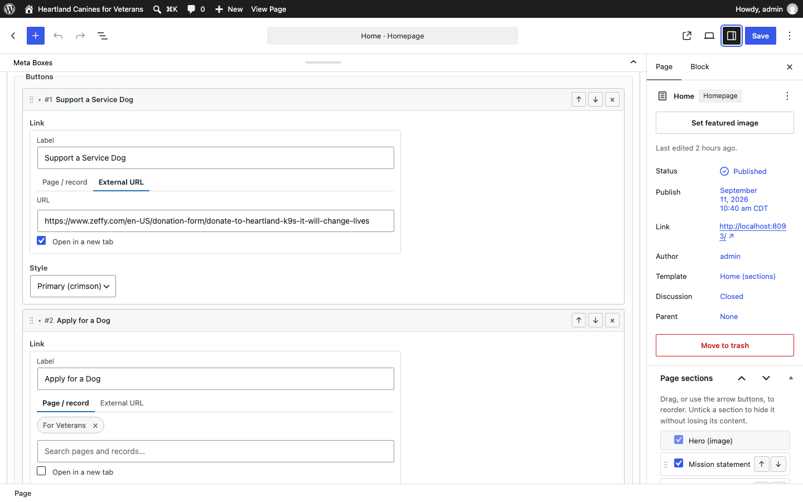

The paragraph under the hero is section **Mission statement** (**Heading**, **Show crimson divider**, **Text**).

## Change the three feature cards

**Pages → Home** → section **Feature cards** → **Cards** repeater. Each card: **Icon**, **Icon color** (Navy / Crimson), **Title**, **Text**, **Link**, **Decorative corner accent**. Section-level options: **Heading**, **Intro**, **Show crimson divider under the heading**, **Card alignment**, **Columns** (2 / 3). Use **Add card** for more; keep three for the reference layout.

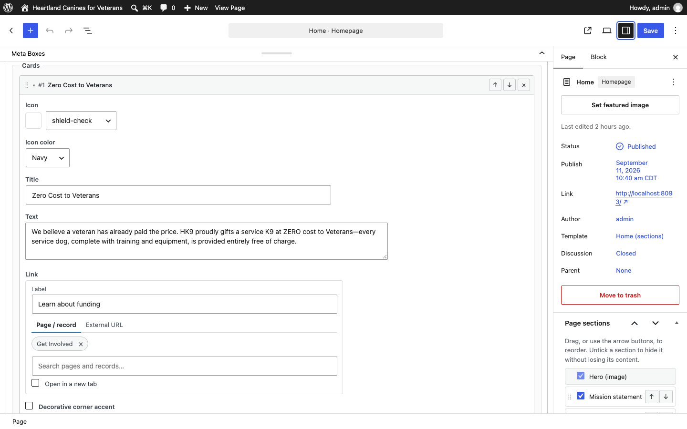

The "BarKode Program" band lower on the page is section **BarKode feature** (**Eyebrow**, **Heading**, **Text**, **Image**, **Image caption**, **Button**, **Show diagonal grid pattern**).

## Swap the testimonial

**Pages → Home** → section **Testimonial** → **Source**:

- **From a Story** — pick a published Story in **Story** (leave empty to use the latest story marked *Featured story*). Quote, name and image come from the Story's Details box.
- **Manual quote** — fill **Quote**, **Name**, **Attribution line** ("Only publish verified details"), **Image**.

**Button** is the "Read More Stories" link. The same pattern exists on the Success Stories page (section **Featured story (overlap card)**).

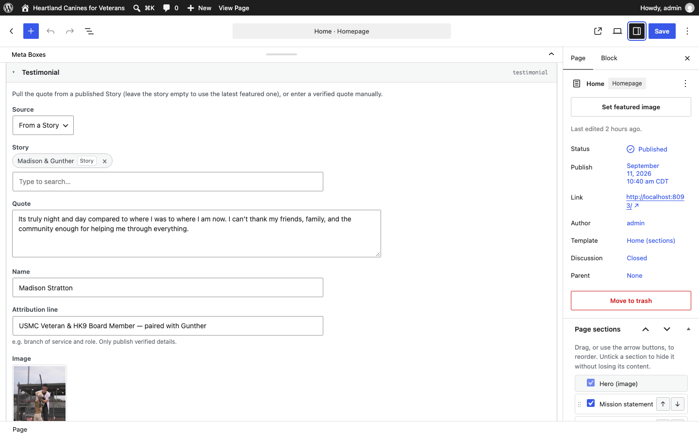

## Edit the About / Program / Veterans / Get Involved / BarKode / Stories / Contact sections

Open the page under **Pages** and edit the section panels. Sections per page:

| Page (template) | Sections |
|---|---|
| About (*About / Mission*) | **Hero (band)**, **Legacy (image + text card)** (Eyebrow badge, Heading, Body, Image, Image position), **Core values** (cards), **Call to action** |
| The Program (*Program*) | **Hero (image)**, **How it works (timeline)** (Heading, Intro, **Steps**: Icon, Title, Text), **K9 providers** (Icon, Heading, Text, Button), **Call to action** |
| For Veterans (*For Veterans*) | **Hero (band)**, **The 5 Questions (checklist card)** (Heading, Intro, **Questions**, Footer text, buttons), **What to expect** (Steps + card fields), **ADA rights band** |
| Get Involved (*Get Involved*) | **Hero (band)**, **Ways to help (cards with buttons)**, **Corporate & community partners** (Icon, Heading, Body, Button, **Show partner logos**) |
| The BarKode Program (*BarKode Program*) | **Hero (image)**, **Dedication story** (Icon, Heading, Body), **How BarKode protects** (cards), **Call to action** |
| Success Stories (*Stories (listing)*) | **Hero (band)**, **Featured story (overlap card)**, **Story list** (Heading, **Source**: automatic or *Pick manually* → **Stories (manual)**, **Number of stories**, **Empty state text**), **Teams in training** (**Show this block**), **Call to action** |
| Contact Us (*Contact*) | **Hero (band)**, **Contact info column** (**Rows**: **Value source** pulls Main phone / Secondary phone / Email / Office hours / Address from Settings, or **Custom text**; Icon, Label), **Form** (**Form provider**, **Gravity Forms form**, **Form shortcode**, **Built-in form**: Contact form / Application inquiry form; **Success heading**, **Success text** — see [Forms](#forms-built-in-gravity-forms-or-a-shortcode)) |

**Hero (band)** fields: **Eyebrow**, **Heading** (defaults to the page title), **Text** (defaults to the page excerpt), **Background pattern** (None / Stars / Diagonal grid). **Call to action** fields: **Heading**, **Text**, **Buttons** (max 2, **Style**), **Background** (Navy / Navy tint / Plain / Muted).

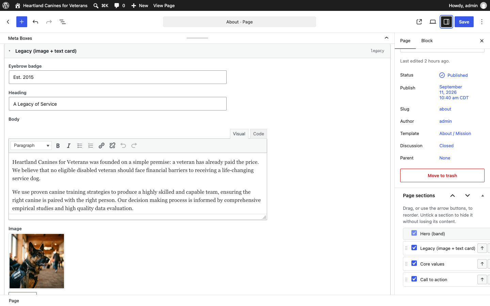
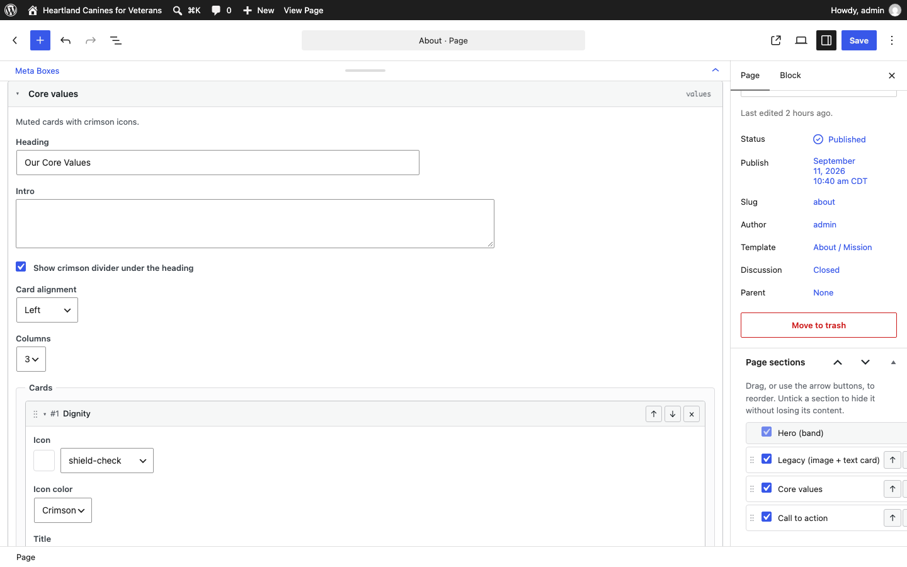

Phone numbers, e-mails and the address on the Contact page come from **Heartland → Settings → Contact** — change them there, not on the page.

## Add or edit a Story, Team, Person, Partner, Campaign, Event

All live under **Heartland → Stories / Teams / People / Partners / Campaigns / Events**. Each has a title, body text, **Featured image** (sidebar) and a **Details** box. Display order for Teams, People, Partners and Campaigns is **Post Attributes → Order** (lower first).

| Type | Details fields | Where it shows |
|---|---|---|
| Story | **Veteran display name** ("Only the name the veteran approved for publication"), **Branch of service**, **Canine name**, **Relationship**, **Pairing year** ("Only if verified"), **Quote**, **Featured story**, **Gallery**, **Related team**, **Source note (internal)** (not shown on the site) | `/stories/<slug>/`, Success Stories page, Home testimonial |
| Team | **Canine name**, **Handler display name**, **Status** (In training / Graduated / Therapy), **Year**, **Featured / highlighted team**, **Gallery**, **Donate link**, **BarKode record**, **Summary** | `/teams/<slug>/`, HK9 Teams in Training page, Our Highlighted Team page |
| Person | **Role / title**, **Email (organization domain only)** (only @heartlandk9s.org is published), **Links**, **Quote** | Meet the Team page (no single page) |
| Partner | **Website**, **Tier**, **Partner since**; tick a **Partner Types** box (Back the Pack Partner, Campaign Sponsor, Community Partner, K9 Provider); logo = Featured image | Back the Pack page, campaign sponsor logos |
| Campaign | **Summary**, **Status** (Active / Completed / Paused), **Start date**, **End date**, **Primary call to action**, **Secondary call to action**, **Sponsors** (pick Partners), **Gallery**, **Goal text**, **Featured campaign** | `/campaigns/<slug>/`, Campaigns page |
| Event | **Start** (required; date + optional time), **End**, **All-day event**, **Time to be announced**, **Timezone**, **Venue**, **Address**, **Registration / tickets link**, **Ticket information**, **Organizer name**, **Organizer contact**, **Status** (Scheduled / Cancelled / Postponed), **Featured event**, **Flyer** | `/events/<slug>/`, Events page (**Upcoming events** / **Past events** split automatically by Start/End) |

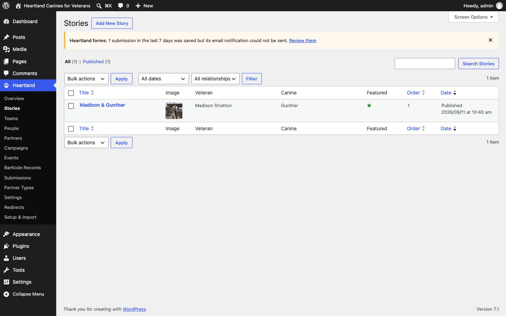
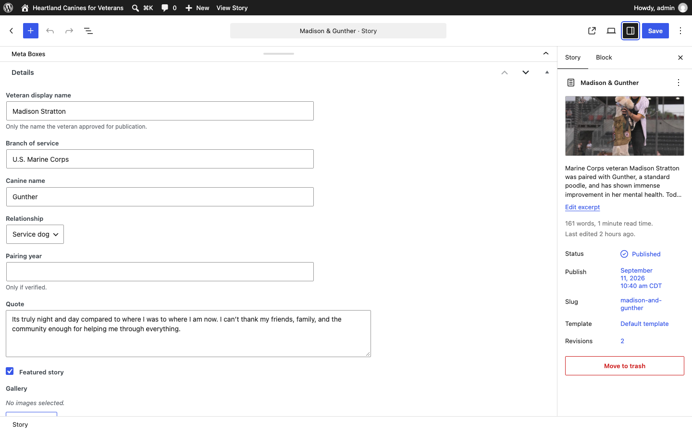
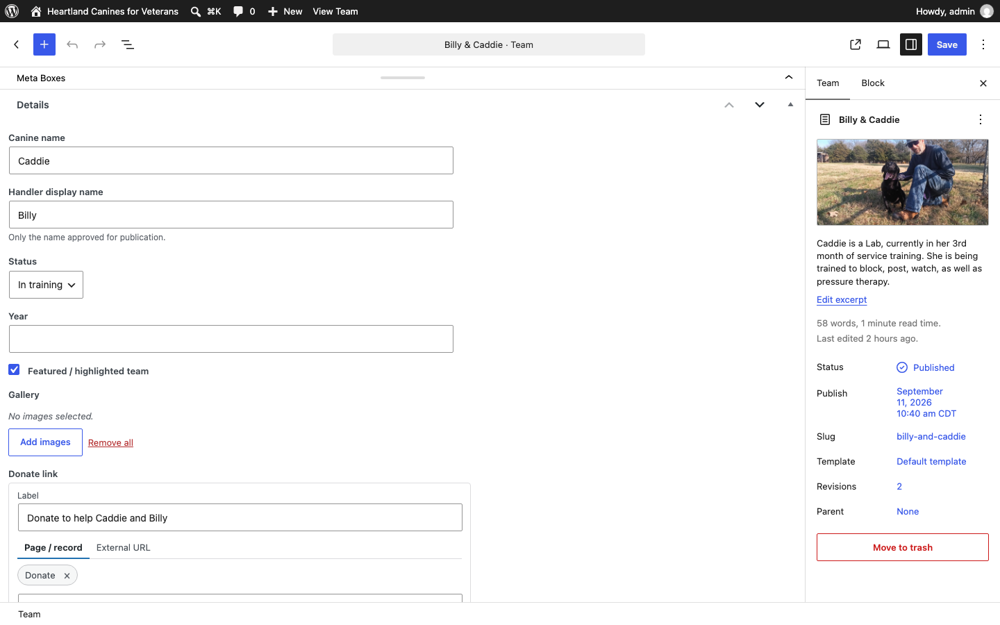
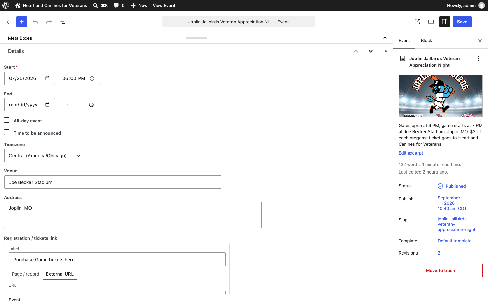
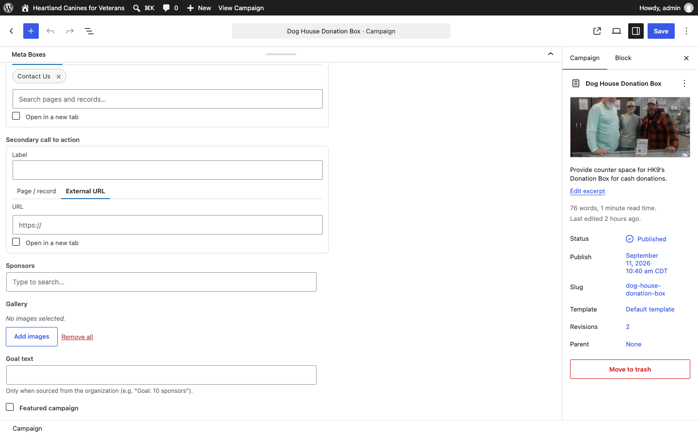
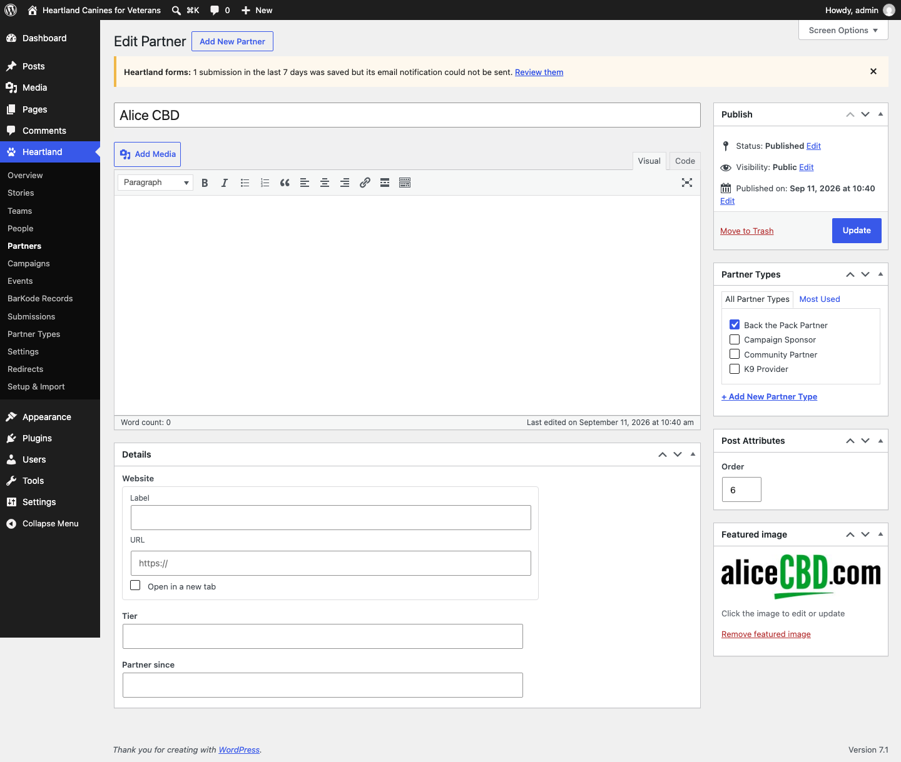

Listing pages (Events, Campaigns, HK9 Teams in Training, Meet the Team, Back the Pack) have a **Source** select: leave it automatic, or choose *Pick manually* and fill the "(manual)" picker to hand-pick and order items.

## Add or update a BarKode record

**Heartland → BarKode Records** (Administrators only, unless *Let Editors manage BarKode registry records* is on under Settings → Advanced). **Add New BarKode Record**, give it a title, upload the dog photo as **Featured image**, fill **Details** and **Publish**. The record URL is `/barkode/<slug>/`.

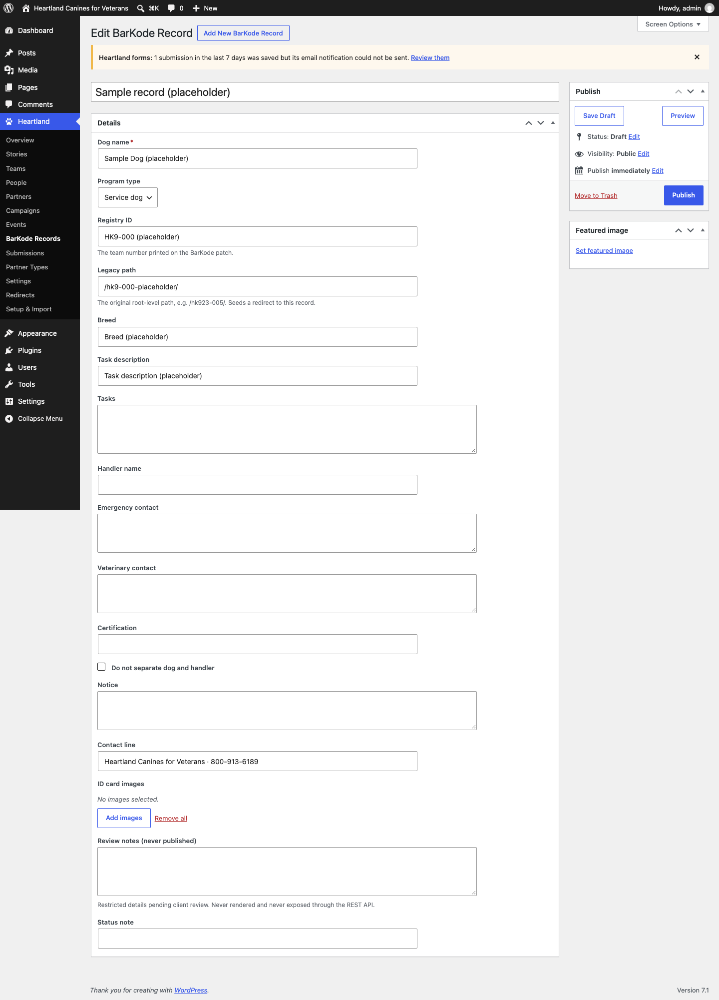

Privacy rules — what is public:

- **Everything in Details is printed on the public record page when filled in**, except **Review notes (never published)**: **Dog name**, **Program type**, **Registry ID**, **Breed**, **Task description**, **Tasks**, **Handler name**, **Emergency contact**, **Veterinary contact**, **Certification**, **Do not separate dog and handler** (red banner), **Notice**, **Contact line**, **ID card images**, **Status note**, plus the photo. Only enter what the handler has agreed to publish.
- **Review notes (never published)** is the place for restricted details: it is never rendered and never exposed through the REST API.
- Record pages are `noindex, nofollow`, excluded from sitemaps, site search, embeds and feeds, and never listed anywhere on the site. They are reached only by scanning the QR patch.
- **Legacy path** documents the original root-level URL printed on the patch (e.g. `/hk923-005/`). The redirect itself is a rule under **Heartland → Redirects** — the rules for existing printed patches are seeded, so for a **new** patch add a redirect there: **Source path** = the printed path, **Destination** = *A BarKode record*, pick the record, **Type** 301. Keep old rules **Enabled** as long as patches are in circulation.
- Do not put records in menus or link to them from pages.

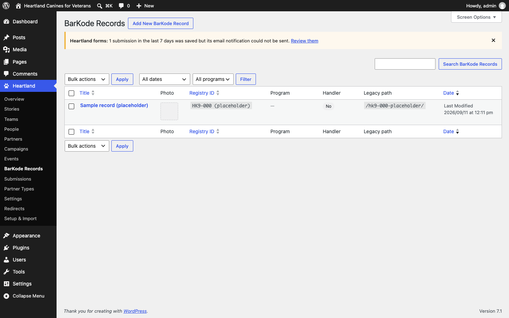

## Edit migrated pages (block editor + optional sections)

Pages such as The HK9 Coloring Book, Heartland Gear, Volunteer, 5 Questions, Service Dogs and the ADA, The Service K9 Program, How it Works, Heartland Obedience Training and Thank You use the **Landing Page** template: text and images are ordinary blocks in the canvas, rendered in the card under the navy hero. Optional sections are ticked off by default in **Page sections** — tick one to show it:

- **Feature cards** — same fields as the Home cards.
- **FAQ** — **Heading**, **Intro**, **Questions** (**Question**, **Answer**), **Source note** (internal).
- **Sponsor tiers** — **Heading**, **Intro**, **Tiers** (**Name**, **Price**, **Quantity / availability**, **Benefits (one per line)**, **Highlight this tier**, **Button**). Used on the Coloring Book page.
- **Call to action**.

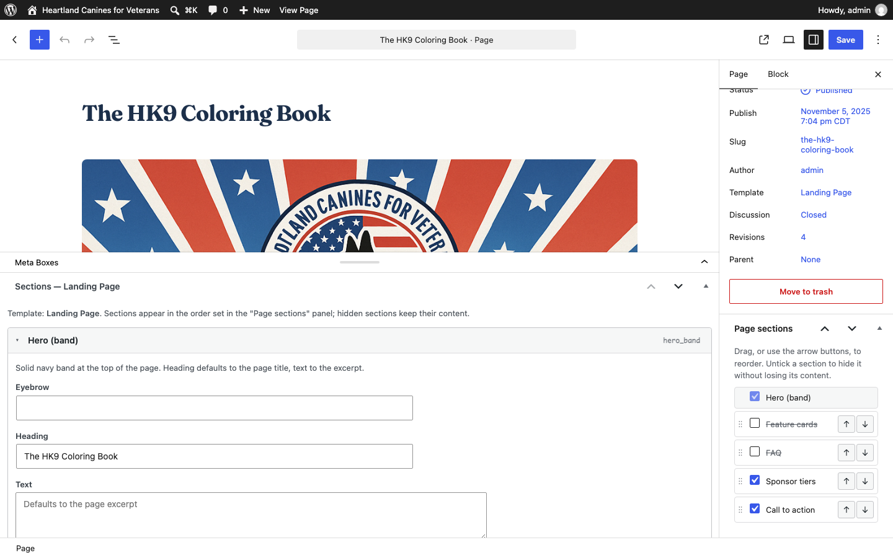
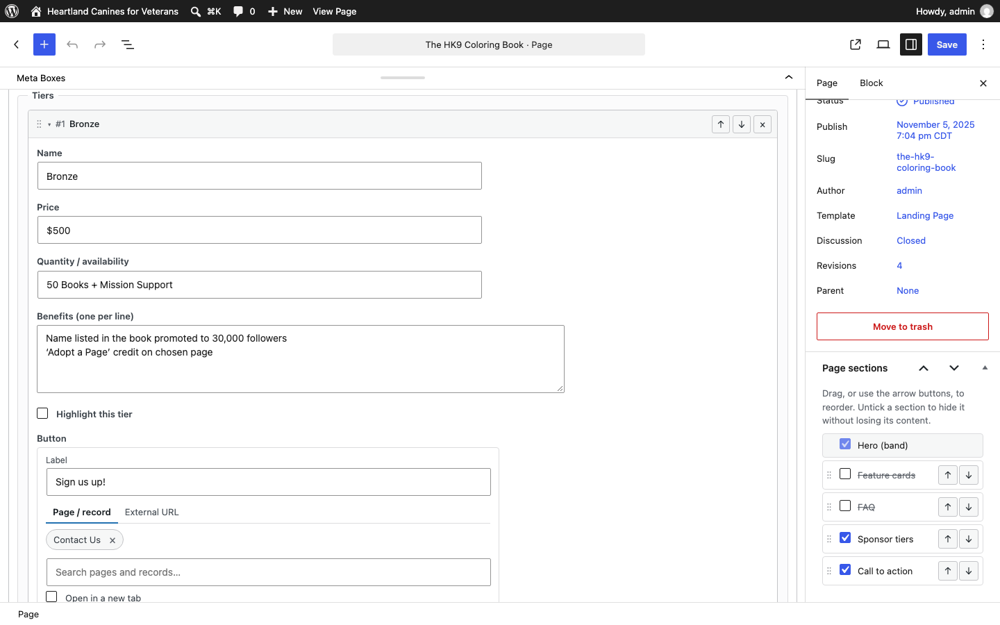

News and Privacy Policy use the default template (hero band + block content, optional Call to action) — see the next section.

## New pages: the default template and the Heartland patterns

**Pages → Add New** gives every new page the default template. Type the title, write in the canvas, publish — the page already looks like the rest of the site:

- The **title** becomes the heading of the navy hero band at the top; the **Excerpt** (sidebar → **Page** tab → **Excerpt**) becomes the line under it. The **Hero (band)** panel under the editor can override both (**Eyebrow**, **Heading**, **Text**, **Background pattern**).
- To start a page **without** the band, untick **Hero (band)** in the **Page sections** sidebar panel: the title is then shown as the first heading of the white content card.
- Everything written in the canvas sits in the white card. Ordinary paragraphs, headings, lists, images and galleries need no styling — they pick up the site's fonts and colours.
- **Call to action** (a band with a heading, one line of text and up to two buttons) is switched off by default; tick it under **Page sections** and fill the panel to end the page with it.
- A blue note at the top of the editor repeats these steps; it can be dismissed.

To build richer layouts, open the block inserter (**+** top left) → **Patterns** tab → **Heartland**. Each pattern is a ready-made group of ordinary blocks in the site design; insert it, then click into any text, picture or button to change it:

| Pattern | What it gives you |
|---|---|
| **Text + image (image left)** / **(image right)** | A photo beside a heading, paragraph and button (stacks on phones). Click the placeholder picture → **Replace** to pick a photo. |
| **Three feature cards** | Three white cards (title, text, "Learn more" link) like the Home page cards; one column on phones. |
| **Call to action band** | Navy band with heading, text and two buttons (crimson + outline). Select the band and switch its **Styles** to **Tinted band** for the light version. Buttons point at the Donate / Volunteer destinations from Settings. |
| **FAQ (details)** | A heading and three expandable question/answer panels; select a panel and **Duplicate** it for more questions. |
| **Two buttons row** | A crimson button and a navy outline button. |
| **Quote / testimonial** | A quote in the rounded muted panel with the name line underneath. Only publish approved names and quotes. |
| **Stats row (3 numbers)** | Three big numbers with a short label each. Use verified figures only. |
| **Contact details block** | A muted card with the phone numbers, e-mail, address and office hours copied from **Heartland → Settings → Contact** at the moment you insert it (edit or delete any line afterwards; changing Settings later does not update a card already on a page — the footer and Contact page do follow Settings). If a phone number or e-mail changes, either edit the card's text on each page that uses it or delete the card and insert the pattern again to pick up the new values. |
| **Section heading with crimson divider** | Centred heading, the short crimson bar and an intro line. |

The same looks are available as block **Styles** (select a block → sidebar → **Styles**) so you can restyle blocks you already have: Group → **Card**, **Card (muted)**, **Navy band**, **Tinted band**, **Statistic**, **Callout panel**; Paragraph → **Lead**; Separator → **Crimson bar**, **Thin rule**; Quote → **Testimonial**; List → **Checklist**; Button → **Navy** (the built-in **Outline** style gives the navy outline button). What you see in the editor is what the page shows.

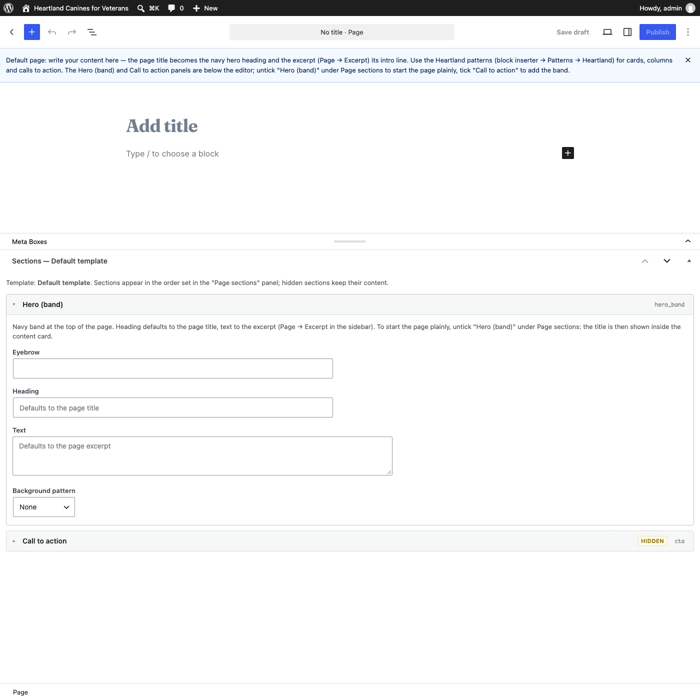
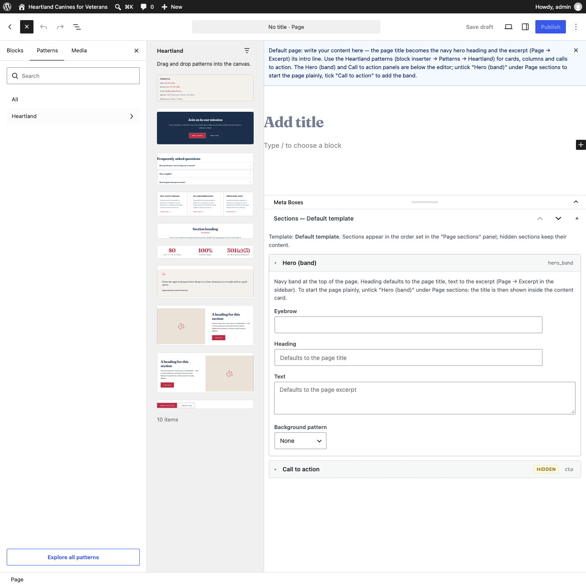

## Adding extra content to section pages

Every section page (Home, About, The Program, For Veterans, Get Involved, BarKode, Stories, Contact, Donate, Events, Campaigns, Partners, People, Teams, Highlighted Team) also accepts ordinary blocks in the editor canvas at the top of the page — paragraphs, images, embeds — so extra content never needs a developer. Whatever you write there is shown in a white card in the same style as landing pages:

- **Page sections → Editor content** (sidebar) decides where: **After the sections** (default — the card comes after the last section), **Before the sections (right after the hero)**, or **Hide**.
- Nothing is shown while the canvas is empty, so pages that only use sections look exactly as before. An empty paragraph block left behind in the canvas (the editor adds one when you click into it) still counts as empty — no blank card appears.
- A blue note at the top of the editor reminds you that the page is built from the section panels below and where the canvas content appears; it can be dismissed.

Landing pages, Thank You, the Online Application intro and the Photos gallery already place the canvas content themselves (in the card under the hero), so the **Editor content** setting does not apply to them.

The **Sections — …** box under the editor and the **Page sections** panel are always shown (they cannot be hidden through *Screen Options*), and the **Sections** box stays first under the editor.

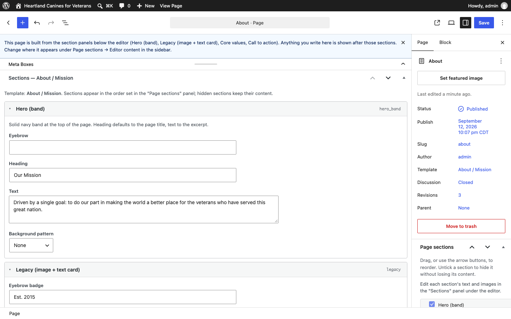
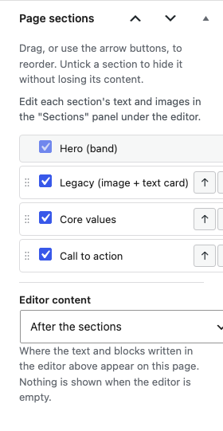

## Photos gallery

**Pages → Photos** (template *Photo Gallery*). The pictures are a **Gallery block** in the page canvas — select it and use the block toolbar to add, remove or reorder images. Section **Gallery options**: **Open images in a lightbox**, **Columns** (2 / 3 / 4), **Show captions**, and **Images**, which is used only when the page has no gallery block.

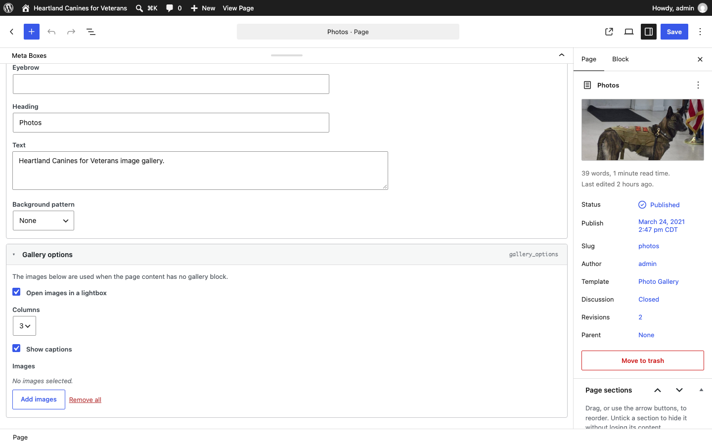

## Donate page options

**Pages → Donate** (template *Donate*) → section **Ways to give** → **Options** repeater: **Icon**, **Logo (optional, replaces the icon)**, **Title**, **Text**, **Button**, **Primary option** (crimson button + "Recommended"). Also **Donate by mail** (**Heading**, **Text**, **Show the mailing address from Settings**) and **Tax statement** (defaults to the *Tax-deductibility statement* in Settings → Contact).

The destinations that "Donate"/"Support a Service Dog" buttons use site-wide are in **Heartland → Settings → Destinations**: **Donate page** and **Online donation form (external)** (the Zeffy form).

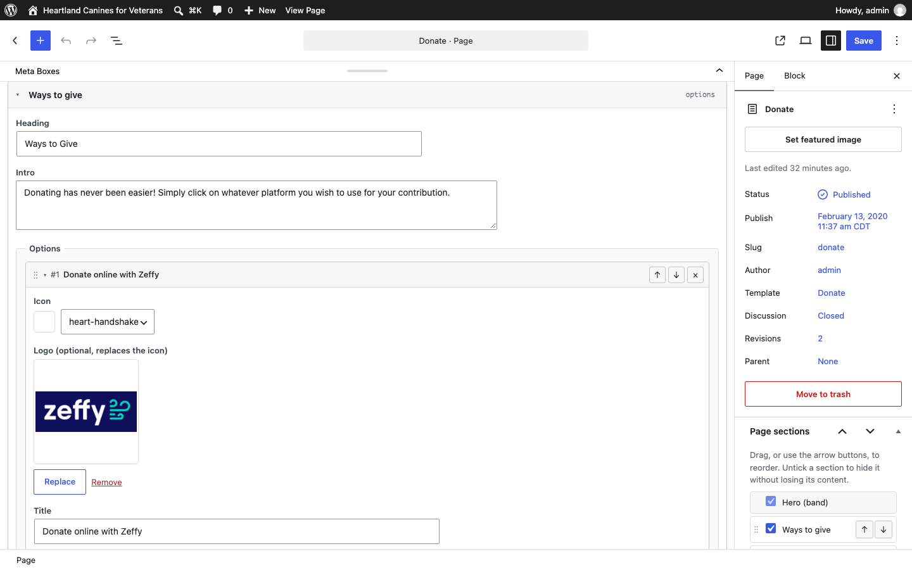

## Menus

**Appearance → Menus**. Five locations (**Manage Locations** tab):

| Location | Where it shows |
|---|---|
| **Primary navigation** | The header menu (and the phone menu). |
| **Footer — Quick Links** | The links under the footer's second column heading. |
| **Footer — Get Involved** | The links under the footer's third column heading. |
| **Footer — Legal** | The small links in the footer's bottom bar (Privacy Policy). |
| **Helpful links (404 & search)** | The "Or try one of these pages" buttons on the "Page not found" page and on empty search results. Optional — when no menu is assigned the theme links Home, About, the K9 provider page, Contact, Donate and News. |

Edit items on the **Edit Menus** tab (add pages from the left column, drag to reorder, nest for dropdowns) and **Save Menu**. Footer column **headings** live in Settings → Footer (that tab also links back here). BarKode records are never offered as menu items — leave it that way.

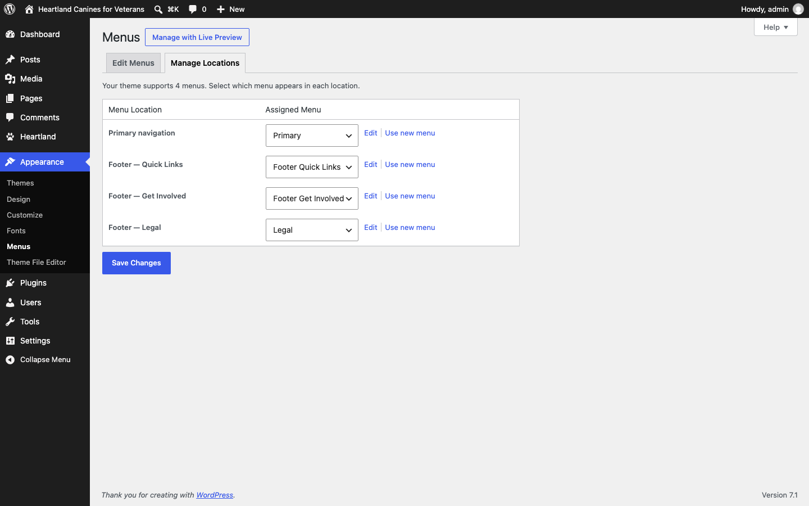
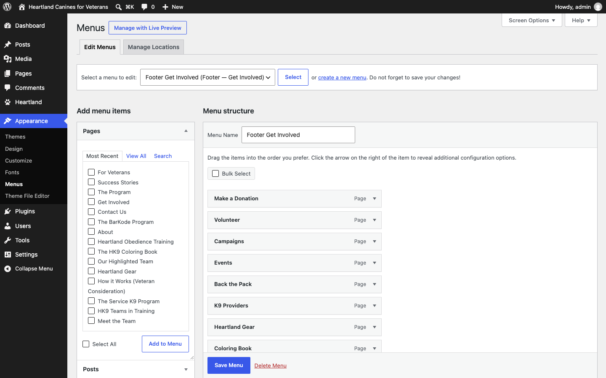

## Global contact details, logos, colors, header CTA, footer

**Heartland → Settings**, one tab each; **Save changes** at the bottom.

- **Branding** — **Header logo**, **Header logo height (px)**, **Footer logo**, **Footer logo height (px)**, **Show the two-line wordmark next to the logo**, **Wordmark line 1 / 2**. The favicon is **Appearance → Customize → Site Identity → Site Icon**.
- **Colors & Fonts** — **Primary (navy)**, **Secondary (crimson)**, **Page background**, **Body text**, **Muted background**, **Muted text**, **Borders**, **Accent**; **Heading font**, **Body font**.
- **Contact** — phones and labels, **General email**, **Director email**, **Development email**, address, **Office hours**, **Office days**, **Service area line**, social URLs (**Facebook**, **Instagram**, **YouTube**, **LinkedIn**, **X (Twitter)**, **TikTok** — each icon appears in the footer only when its URL is filled in), **Candid / GuideStar profile URL**, **EIN**, **Legal name**, **Tax-deductibility statement**. Feeds the footer, Contact page, Donate page and structured data.
- **Destinations** — where recurring buttons point (Donate page, Online donation form, Veteran application, 5 Questions page, Volunteer, listings, gear shop, …). "Pick a page or enter an external address — never an ID."
- **Header** — **Show the header button**, **Header button label**, **Header button destination** (falls back to the Donate page), **Sticky header**.
- **Footer** — **Description**, **Tagline**, **Column 2/3/4 heading** (the links under them are menus — the **Column links** note on this tab links to Appearance → Menus), **Copyright line** (`{year}` auto-fills), **Credit line** ("Built with ♥ for our veterans" — the ♥ becomes the heart icon), **Credit "by" label** and **Credit "by" link** (printed after it as "… by Cosmick Media." with the name linked; empty the label to drop the "by" part, empty the credit line to hide the whole line), **Show the GuideStar seal in the footer**.
- **Blog** — listing options (see [Blog / News](#blog--news)) plus **Search box placeholder** (the hint text in the search field) and a note pointing to the **Helpful links (404 & search)** menu location.

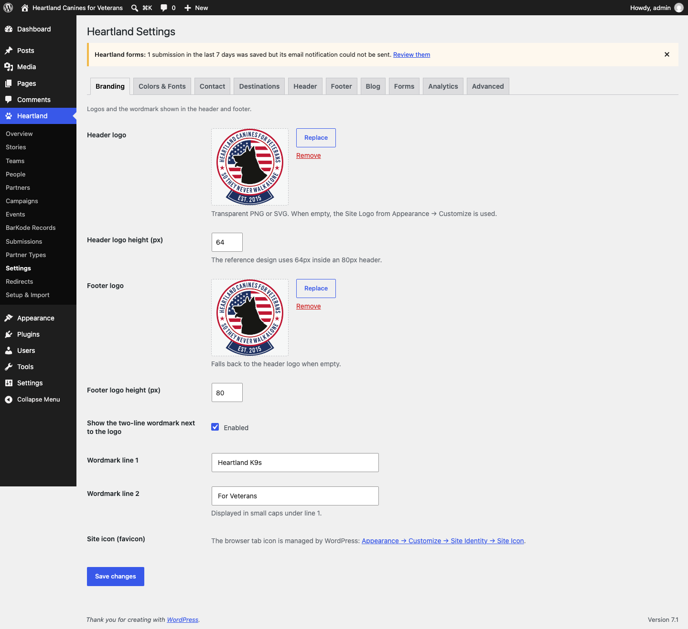
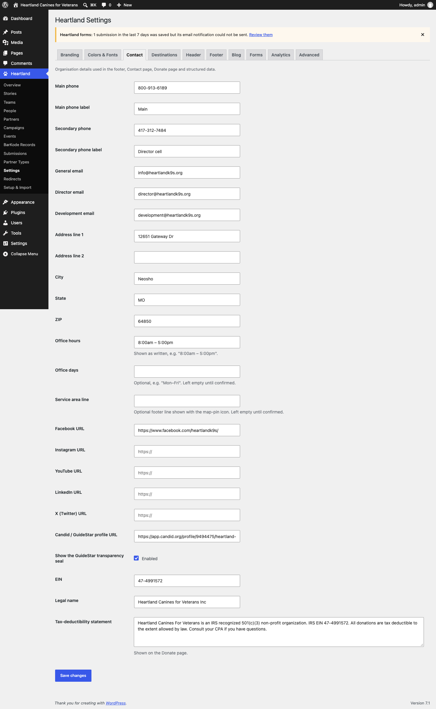
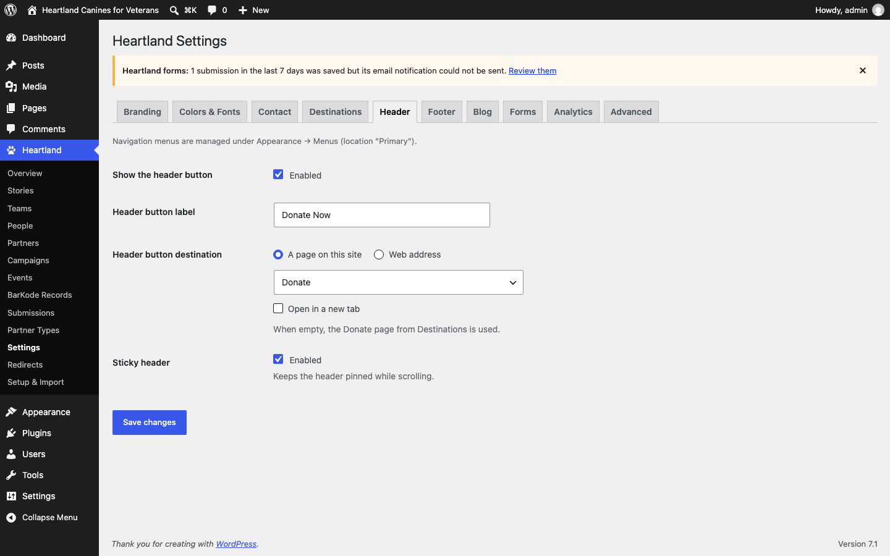
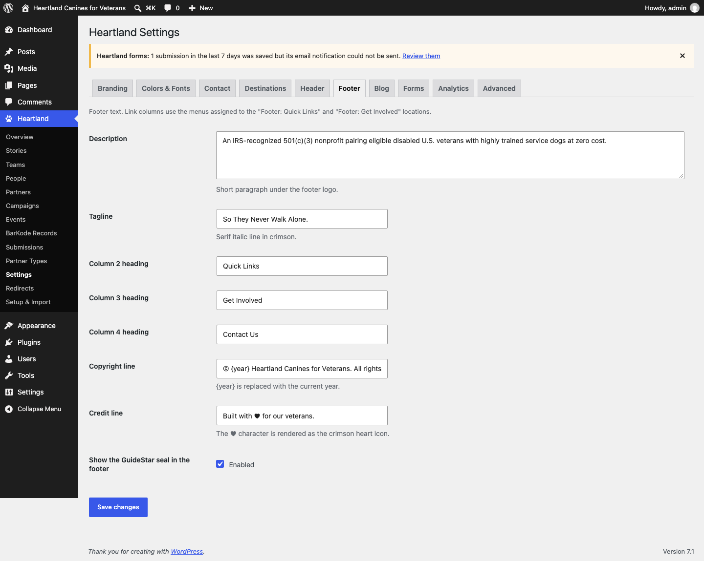

## Forms: built-in, Gravity Forms or a shortcode

The Contact page (**Form** section) and the Online Application page (**Form** section) each show one form. Which form is decided by **Form provider**:

- **Site default (Settings → Forms)** — the normal choice: follows **Heartland → Settings → Forms → Default form provider**, so switching the whole site is one setting.
- **Built-in form (this plugin)** — the plugin's own contact / application inquiry form (recipients, subjects, success text and stored submissions are configured under Settings → Forms, see below).
- **Gravity Forms** — pick a form in **Gravity Forms form** (the list shows the forms built under **Forms** in the admin menu; leave it on *Use the site default form* to use the form chosen in Settings → Forms). The form's title and description are hidden, it submits without a page reload, and it is styled to match the site. When Gravity Forms is not active, or has no forms yet, the list says so instead of offering forms. A form that has since been trashed or deleted stays selected as *Form #n (unavailable)* — saving the page does not clear it — and the page shows the built-in form until you pick another form or restore that one.
- **Form shortcode** — paste a form plugin's shortcode into **Form shortcode**, e.g. `[gravityform id="2" title="false" ajax="true"]`. Only the shortcode itself is kept; any other text or HTML you paste there is removed.

Site-wide: **Heartland → Settings → Forms** → **Default form provider** (Built-in / Gravity Forms / Form shortcode), **Gravity Forms: contact form** and **Gravity Forms: application form** (which Gravity form each page uses unless the page picks its own). With **Form shortcode** as the site default, each page's **Form shortcode** field supplies the shortcode.

### Gravity Forms: automatic set-up

Gravity Forms is the organisation's own licensed plugin (it is not part of this theme/plugin package). Once it is installed and activated, the two Heartland forms are created in it for you — nothing has to be built by hand:

- **When**: automatically at the end of an import run, or the first time **Heartland → Settings → Forms** is opened with Gravity Forms active. If that did not happen (for example Gravity Forms was installed later and no import has run since), open **Settings → Forms** and click **Create the Heartland forms in Gravity Forms** in the *Heartland forms in Gravity Forms* row. Command line: `wp hk9 gravity provision` / `wp hk9 gravity status`.
- **What is created**: **Contact** (First Name / Last Name, Email Address, Subject — the subjects from the *Contact form subjects* list —, Message; button "Send Message"; a "Message Sent" confirmation) and **Initial Application Inquiry** (First Name / Last Name, Email Address, Phone, City, State, "I am a" (Veteran / Family member of a veteran / Other), "How did you hear about us?", "Tell us about yourself" and the required "I have read the 5 Questions…" checkbox linking to the 5 Questions page; button "Submit Inquiry"; confirmation = redirect to the *Application inquiry success page*, i.e. Thank You) — the same fields, wording and buttons as the built-in forms. Each form has one notification, *Admin notification*, addressed to the recipients configured under Settings → Forms at the time of creation, with *Reply-To* set to the sender's address. (If the forms were created before the import ran — recipients not yet set — the end of the import fills in the imported recipients and sender, as long as you have not edited those values in Gravity Forms in the meantime.) The forms are styled to look exactly like the built-in ones.
- **Afterwards** the site is switched to **Default form provider: Gravity Forms** and the two forms are selected in the pickers — only when no Gravity form had been selected before; a provider or form you chose yourself is never changed. The row shows the status of both forms (with links to edit them) and reports when one was trashed, deleted, deactivated or built with an older definition; **Re-create / update the Heartland forms** brings them back to the standard definition (existing Heartland forms are updated in place — entries and any notifications you added in Gravity Forms are kept; a trashed or deleted form is created again). A form you picked or built by hand in Gravity Forms is never rewritten by it — the row says "picked by hand; left as is" and the button only appears when there is a Heartland form to update or re-create; to get the Heartland definition for that role, clear the picker and click Create. Nothing is ever deleted by this.

**Where to edit what, once the forms live in Gravity Forms**

| Want to change… | Edit in |
|---|---|
| Fields, labels, choices, required marks, validation messages, the submit button text | **Forms → Contact / Initial Application Inquiry** (Gravity Forms editor). Keep the form's *CSS Class Name* (`hk9-gf-form hk9-gf-form--contact` / `…--application`) — it is what makes the form take the site's styling and wording. |
| **Who receives the e-mails**, the subject line, Reply-To, extra copies | **Forms → (form) → Settings → Notifications** → *Admin notification*. The *Contact form recipients* / *Application inquiry recipients* / *From* fields under **Heartland → Settings → Forms** are only used to **seed** that notification when a form is created or re-created — editing them later does **not** change the Gravity Forms notification. |
| The message shown after sending, or the page the application redirects to | **Forms → (form) → Settings → Confirmations** (*Default Confirmation*). The Heartland *Contact form success message* / *Application inquiry success page* settings apply to the built-in forms and seed the Gravity confirmations. |
| Reading and exporting submissions | **Forms → Entries** (Gravity Forms). Submissions made through Gravity Forms are not listed under Heartland → Submissions — that list only holds built-in form submissions. |
| Spam protection | Gravity Forms' honeypot is on for both forms; add its reCAPTCHA / Akismet add-ons under **Forms → Settings** if needed. |
| Which form a page shows, the heading / intro / notice around it | The page's **Form** section (see above) and Settings → Forms. |
| Switching back to the built-in forms | **Settings → Forms → Default form provider: Built-in form** (the Gravity forms stay in place and can be re-selected later). |

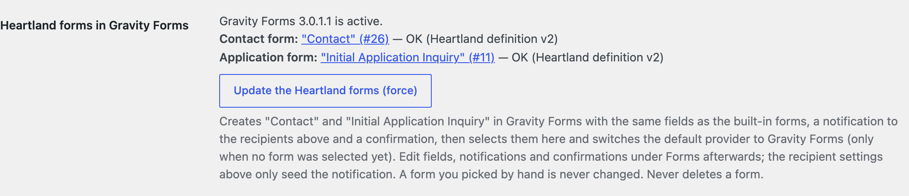

What stays the same whichever provider you choose: the section **Heading** and **Intro** (Contact), the **Heading**, **Notice above the form** and the **Before you apply / Read the 5 Questions** card (Application; the card follows **Show the "5 Questions" link**). **Success heading / Success text / Success page** only apply to the built-in form — Gravity Forms and shortcode forms show their own confirmation.

Safety net: if Gravity Forms is deactivated, the chosen form is deleted or trashed, a shortcode's plugin is switched off, or the chosen form or shortcode produces nothing on the page (for example a shortcode that needs content it did not get), the page shows the built-in form again and logged-in editors see a short note above it explaining why (visitors see only the form).

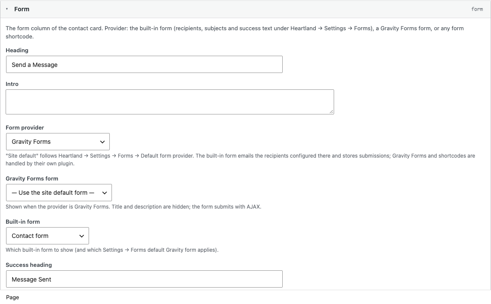
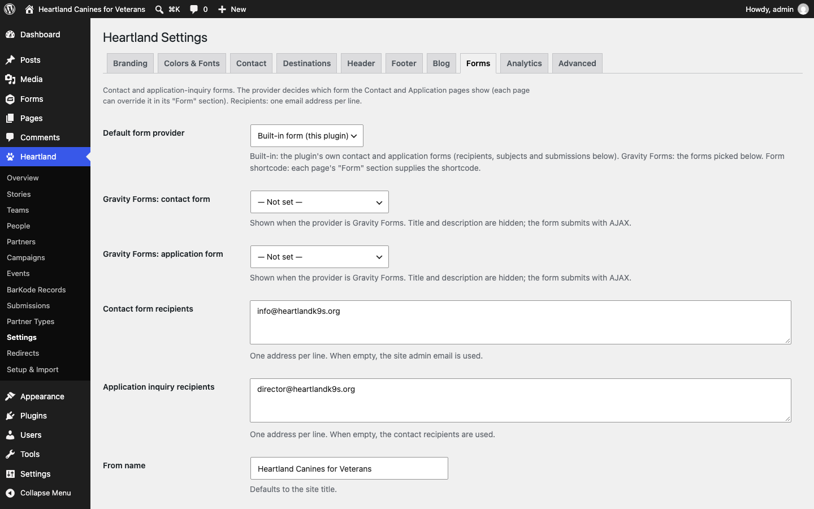

## Forms: recipients, viewing submissions, retention

**Heartland → Settings → Forms**: **Contact form recipients** and **Application inquiry recipients** (one address per line), **From name**, **From email** (must be on the site's domain), **Contact form subjects** (Value / Label rows), **Submissions per hour per visitor**, **Keep a copy of each submission in Heartland → Submissions**, **Delete stored submissions after (days)** (0 keeps forever), **Contact form success message**, **Application inquiry success page**. Leave **Trusted proxy addresses** / **Client IP header** alone unless the host puts a CDN in front of the site. These settings drive the **built-in** forms; with Gravity Forms as the provider the recipients and confirmations live in each Gravity form's *Notifications* / *Confirmations* (the Heartland values only seed them when a form is created — see the table above).

**Heartland → Submissions** lists stored submissions (Form, Name, Email, Date, **Mail sent**); open one to read it. Submissions are read-only — use Trash to remove one. A yellow notice on Heartland screens warns when a notification e-mail could not be sent; the message is still stored, so check the list.

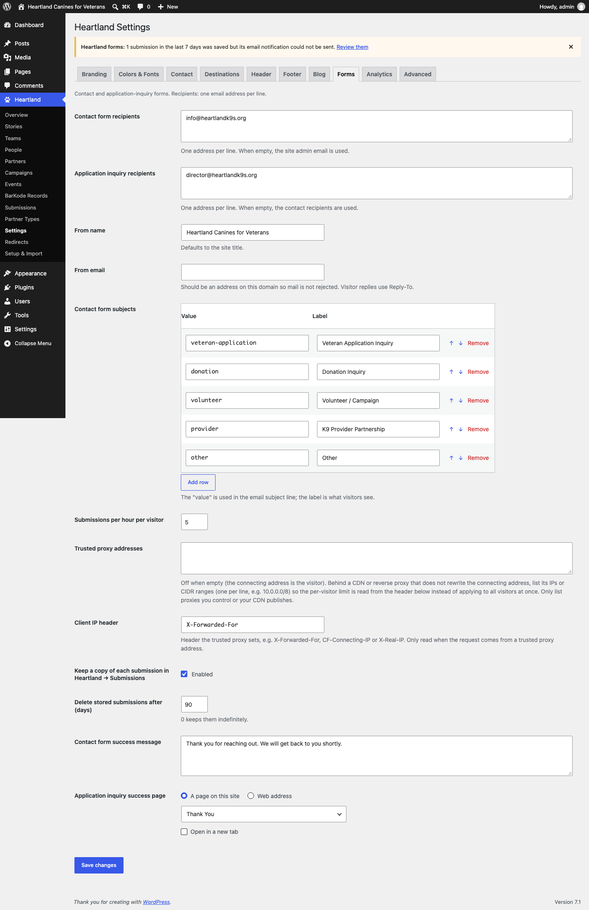
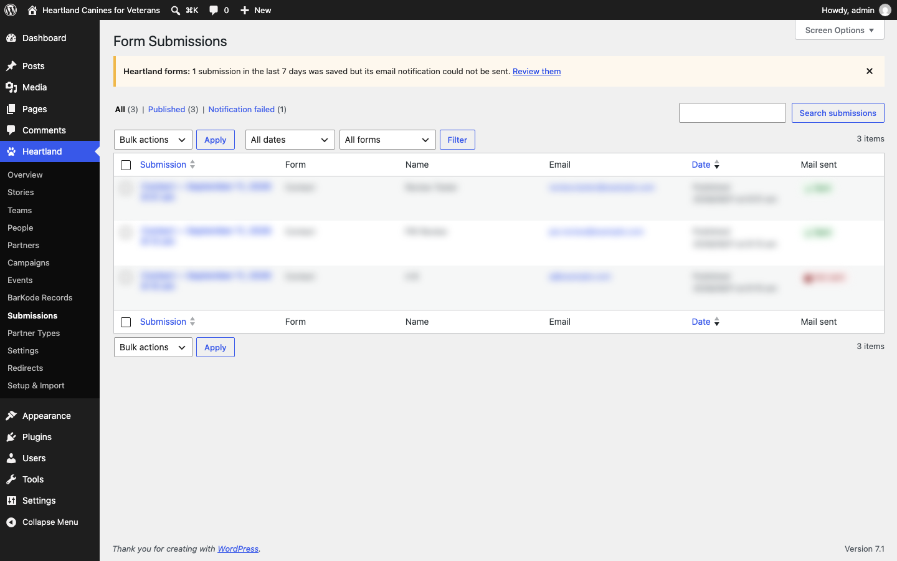

## Blog / News

Write under **Posts**. The listing is the **News** page, set as **Posts page** in **Settings → Reading** (keep **Homepage** = Home, **Posts page** = News). Listing appearance is **Heartland → Settings → Blog**: **Listing layout**, **Listing title**, **Listing intro**, **Listing hero image**, **Show featured images / dates / author names / categories / tags / related posts**, **Related posts count**.

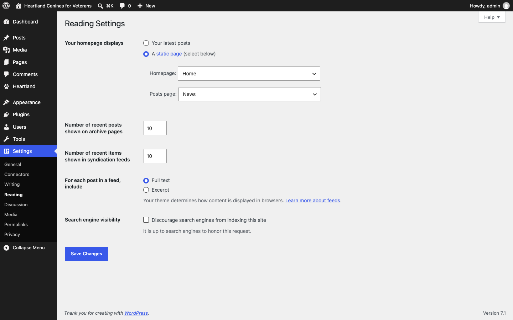
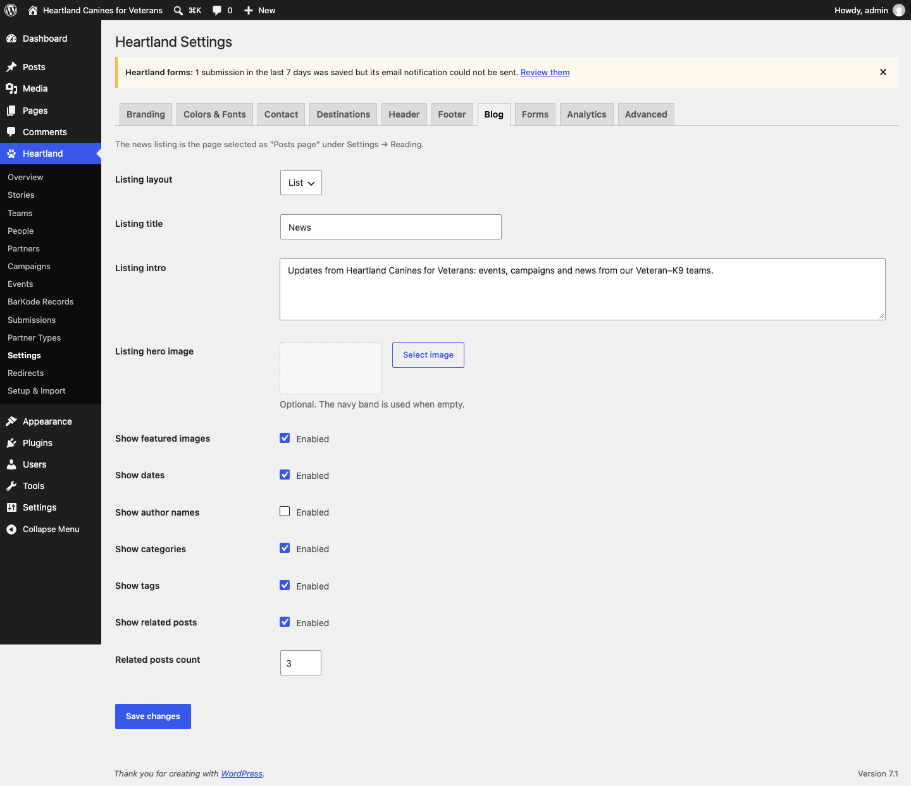

## Redirects

**Heartland → Redirects**. **Add redirect**: **Source path** (site-relative, e.g. `/old-page/`), **Destination** (*A page or item on this site*, *A BarKode record*, or *A path or web address*), **Type** (301 Permanent, 302 Temporary, 410 Gone), **Note**, **Enabled**. Rules marked **seed** cover the printed BarKode patch URLs and old gallery/slider links: they cannot be deleted, only disabled. **Restore missing seeds** puts them back. Row actions let you enable, disable and test a rule.

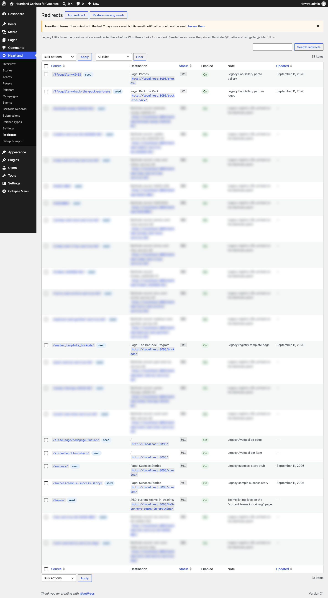
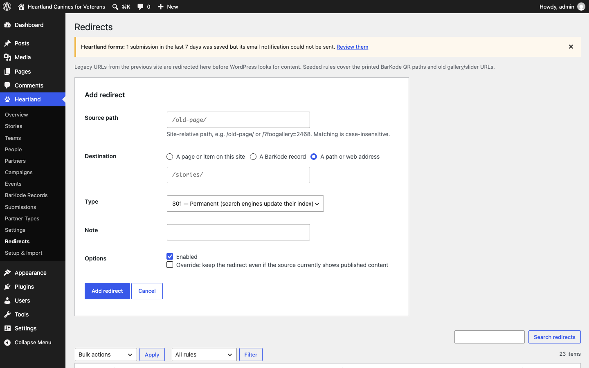

## Re-running the importer safely

**Heartland → Setup & Import** (Administrators). Re-runs skip what is already in place and **keep edits made on this site** — changed items show as a *Conflict* count, not an overwrite.

1. Select the payload (**Upload a payload ZIP** → **Upload & unpack**, or a server path).
2. Click **Dry run**; only *Create* / *Update* counts will change anything.
3. Click **Import**. Leave **Overwrite conflicts (revert edits made on this site to the payload values)** unticked unless you deliberately want to discard site edits.
4. If needed, **3. Runs & rollback** → **Rollback…** removes only what that run created; edited records are skipped unless you tick *Force*.

Never leave a payload ZIP in a web-readable folder: it contains registry data.

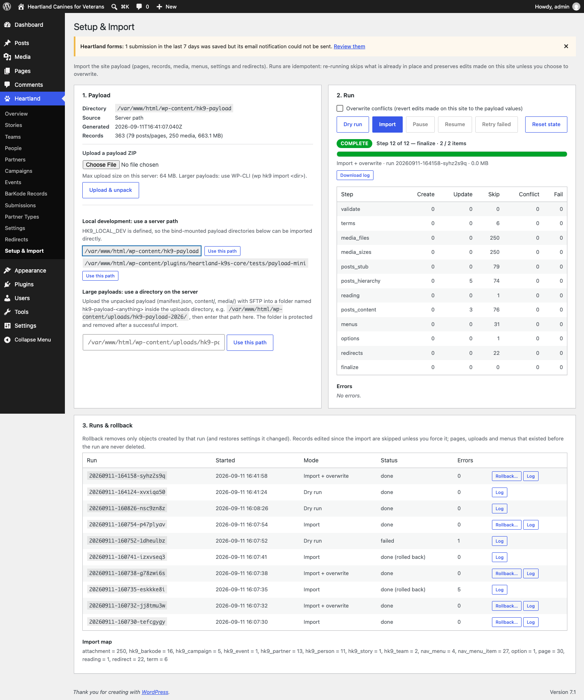

## What not to do

- **Do not add BarKode records to menus or link to them from pages.** They are reached only from the QR patch; the menu screen does not offer them, so do not add them as custom links either.
- **Do not delete the listing pages** Success Stories, Events, Campaigns, The BarKode Program, Meet the Team, HK9 Teams in Training, Back the Pack, Photos, News (or Home, Donate, Contact Us): buttons, menus, Destinations and pagination depend on them. Hide a section instead.
- **Do not change the slugs** `stories`, `events`, `campaigns`, `barkode`, `meet-the-team`, `hk9-current-teams-in-training`, `back-the-pack`, `photos`, `news` — the `/page/2/` rules, seeded redirects and Destinations point at them. Do not nest pages under them (the editor refuses).
- **Do not change a page's Template casually**: the sections box switches to the new template's sections.
- **Do not publish unverified names, years or quotes** — use approved display names only; keep sourcing notes in the internal fields.
- **Do not turn on Settings → Advanced → *Delete all Heartland content and settings when the plugin is deleted*** unless you intend to wipe the content.
